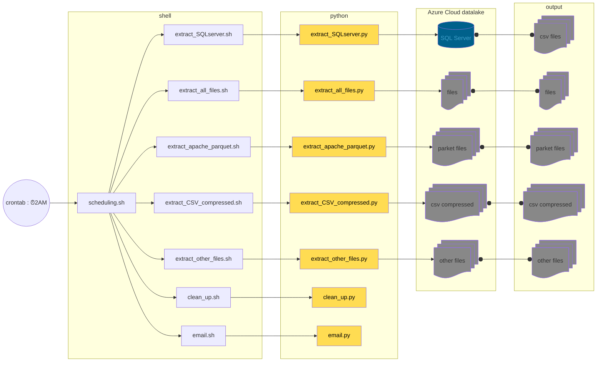

# data-lake-adventureworks
Projet d'école : Extraction de données multi-sources pour alimenter un datalake
* table d'une BDD SQL-server
* Fichiers CSV compressés sur un data lake [Fichier de données]
* Autres Fichiers [Fichier de données]
* Fichiers Apache Parquet sur un data lake [Système big data]

## installation
à faire avant le *pip install -r requirements.txt*

Pour installer les dépendances nécessaires, exécutez la commande suivante dans bash et non dans zsh :

```bash
sudo apt-get update
sudo apt-get install libpq-dev python3-dev
sudo apt-get install unixodbc unixodbc-dev
sudo ACCEPT_EULA=Y apt install msodbcsql18
```

Faire une installation manuelle de unixodbc si besoin
```bash
tar -xzf unixODBC-2.3.12.tar.gz
cd unixODBC-2.3.12
./configure
make
sudo make install
```

si besoin, mettre à jour les fichiers */etc/odbcinst.ini* et */etc/odbc.ini*
```bash
ls /etc/odbcinst.ini /etc/odbc.ini
```
créer les fichiers manquants

MAJ de */etc/odbcinst.ini*
```bash
sudo nano /etc/odbcinst.ini
```
```ini
[ODBC Driver 18 for SQL Server]
Description=Microsoft ODBC Driver 18 for SQL Server
Driver=/opt/microsoft/msodbcsql18/lib64/libmsodbcsql-18.0.so.1.1
UsageCount=1
```

MAJ de */etc/odbc.ini*
```bash
sudo nano /etc/odbc.ini
```
```ini
[MyDSN]
Description=My SQL Server Data Source
Driver=ODBC Driver 18 for SQL Server
Server=your_server_address
Database=your_database_name
```

pour tester
```bash
which odbcinst
odbcinst -q -d
```
*odbcinst -q -d* doit retourner le nom du driver utilisé

## organisation
ajout du CI/CD

mise en place de logs

ajout de la crontab à 2H00 du matin

